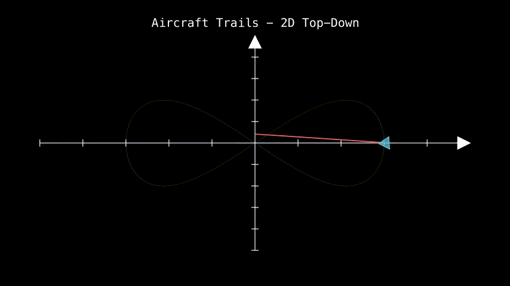
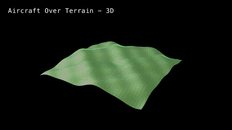
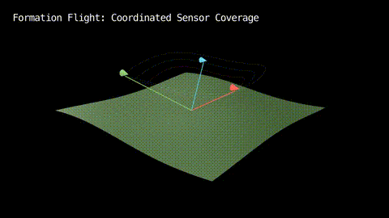
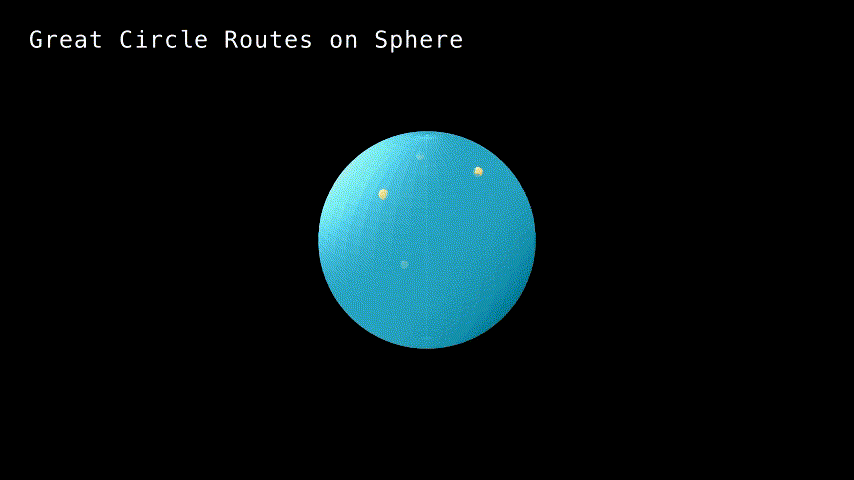
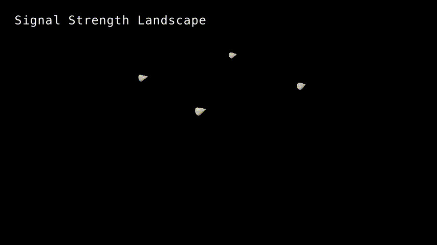

# Manim Experiments

Python Manim Community Edition experiments and examples for creating 3Blue1Brown style mathematical animations.

## Quick Start

```bash
# Setup
uv sync

# Render animation
uv run manim -pql basic_example.py BasicExample

# View GIFs
ls media/animations/*.gif
```

## Project Structure

```
manim-experiments/
├── basic_example.py              # Simple circle
├── animated_line.py              # Axes with moving point
├── transform_example.py          # Shape transformation
├── complex_animation.py          # Grid with animations
├── fibonacci_spiral.py           # Mathematical concept
├── best_practices_demo.py        # Best practices overview
├── recent_showcase.py            # Showcase of experiments
├── docs/
│   └── skills/
│       ├── manim-best-practices.md
│       └── manim-agent-skill.md
├── media/animations/             # Animated GIFs
└── pyproject.toml
```

## Recent Experiments

### 1. Basic Example
Simple circle creation with fill and stroke.


**Code**: `basic_example.py`

### 2. Animated Line
Axes with quadratic function plot and moving point.


**Code**: `animated_line.py`

### 3. Transform Example
Square morphing into circle with text labels.


**Code**: `transform_example.py`

### 4. Complex Animation
9 colored circles in grid with rotation and expansion.


**Code**: `complex_animation.py`

### 5. Fibonacci Spiral
Golden ratio concept with growing rectangles.


**Code**: `fibonacci_spiral.py`

### 6. Best Practices Demo
Overview of key Manim patterns and practices.


**Code**: `best_practices_demo.py`

### 7. Recent Showcase
Summary of all experiments.


**Code**: `recent_showcase.py`

## Advanced Visualization Topics

### Topic 1: Data Variation Analysis
Research-based visualizations of how data varies: histograms morphing to kernel densities, ridgeline plots, violin+jitter, and novel breathing variation field.


*Histogram → Density morph*


*Ridgeline plots across conditions*


*Violin + jitter anatomy*


*Novel breathing variation field*

**Code**: `data_variation_analysis.py`

### Topic 2: Aircraft with Trails/Sensors Over Terrain
Visualizations of aircraft flight paths, sensor coverage, and terrain mapping in both 2D and 3D. Features fading trails, pulsing sensors, formation flight, and novel heat-map coverage analysis.

#### 2D Top-Down with Sensor Pulses
Aircraft following an elliptical path with directional heading, fading red trail, and expanding blue sensor pulses.



#### 3D Terrain with Dynamic Flight Path
Aircraft flying over multi-frequency procedural terrain with elevation-responsive coloring, sensor sphere, and spiral flight path.



#### Formation Flight (Novel)
Three coordinated aircraft in formation with independent trails and synchronized sensor coverage over terrain.



#### Sensor Coverage Heat Map (Novel)
Accumulated sensor intensity visualization showing red (high coverage) to blue (low coverage) mapping as aircraft patrols terrain.


**Code**: `aircraft_trails_terrain.py`

**Features Implemented:**
- Fading trail visualization with `TracedPath`
- Directional aircraft heading based on velocity vector
- Expanding sensor pulse rings
- 3D procedural terrain generation
- Multi-aircraft coordination
- Heat-map accumulation algorithm
- Camera movement and 3D perspective control

### Topic 3: Geolocation Function Visualization
Comprehensive exploration of geographic coordinate systems, distance calculations, and positioning algorithms with both traditional and novel visualizations.

#### Great Circle Routes on Sphere
Geodesic paths between world cities using spherical linear interpolation (slerp) on a 3D globe.



#### Haversine Distance Calculation
Distance formula visualization between NYC and London with expanding range circles and precise kilometer calculation.


#### GPS Trilateration
Position finding from multiple satellite distances showing intersection of range circles.


#### Coordinate System Transformation
Animated morphing between geographic (lat/long) and Cartesian coordinate grids.


#### Signal Strength Landscape (Novel)
3D surface visualization showing combined signal strength from multiple towers, with device path following the landscape topology.



**Code**: `geolocation_functions.py`

**Features Implemented:**
- Spherical linear interpolation for great circles
- Haversine distance formula with Earth radius
- Trilateration positioning algorithm
- Dynamic coordinate system transformations
- Inverse-square law signal propagation
- Surface projection for signal strength
- Real-time geodetic calculations

## Best Practices

### Installation

```bash
# Python environment
uv sync

# Check installation
uv run manim --version
uv run manim checkhealth
```

### Quality Flags

- `-pql`: Preview low quality (fast development)
- `-pm`: Preview medium quality
- `-pqh`: Preview high quality
- `-qk`: 4K quality

### Core Patterns

**Basic Scene**
```python
from manim import *

class MyScene(Scene):
    def construct(self):
        circle = Circle()
        self.play(Create(circle))
        self.wait()
```

**Grouping**
```python
group = VGroup(Circle(), Square(), Triangle())
group.arrange(RIGHT)
```

**Sequential Animation**
```python
self.play(*[GrowFromCenter(obj) for obj in objects], lag_ratio=0.1)
```

**Transformations**
```python
self.play(Transform(old_shape, new_shape))
```

## Skills & References

- [Manim Best Practices](docs/skills/manim-best-practices.md) - Comprehensive guide
- [Agent Skill](docs/skills/manim-agent-skill.md) - For AI agents using Manim
- Official docs: https://docs.manim.community/
- GitHub: https://github.com/ManimCommunity/manim

## Existing Skills

- **adithya-s-k/manim_skill**: Comprehensive best practices collection (1,054 stars)
  - URL: https://github.com/adithya-s-k/manim_skill
  - Includes manimce-best-practices with rule files

## Common Pitfalls

1. Version confusion: ManimCE vs ManimGL
2. Missing system dependencies (cairo, ffmpeg, LaTeX)
3. Outdated tutorials with old syntax
4. Performance: Always use low quality for testing

## License

MIT
